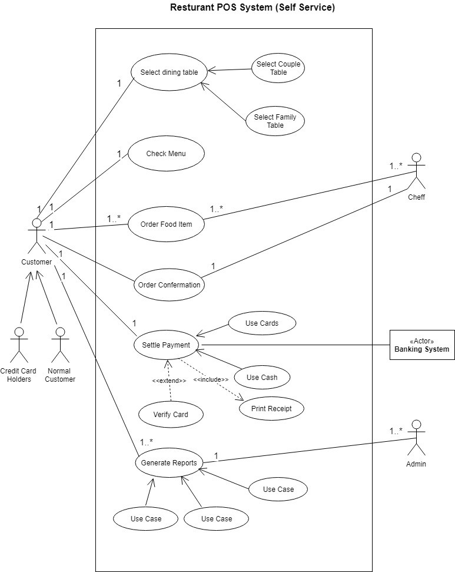
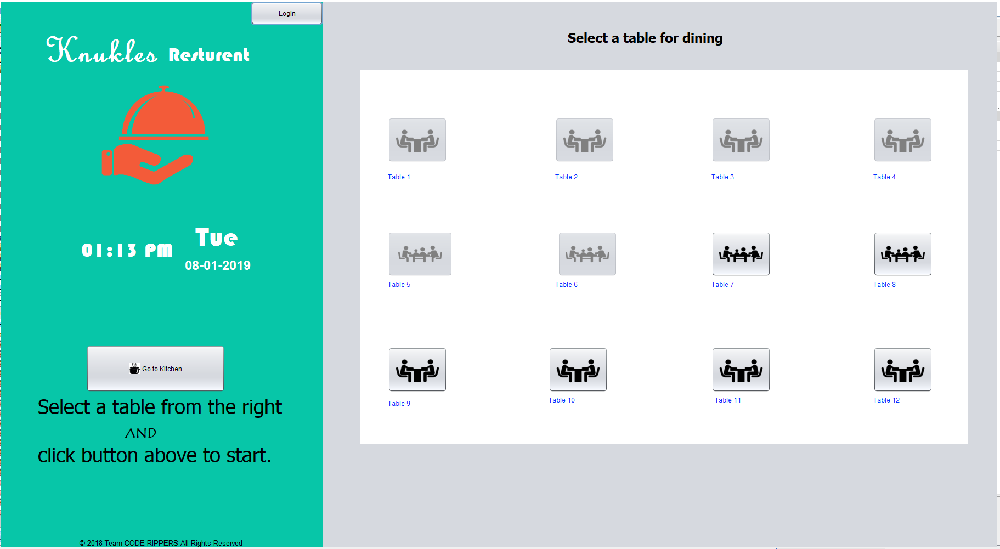
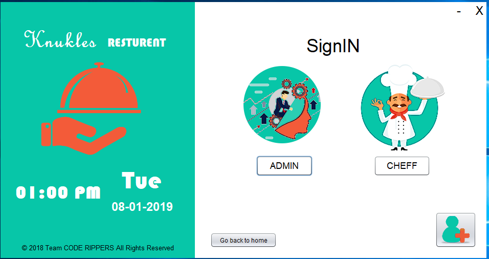
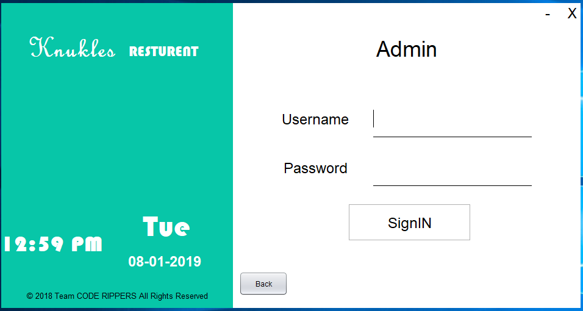
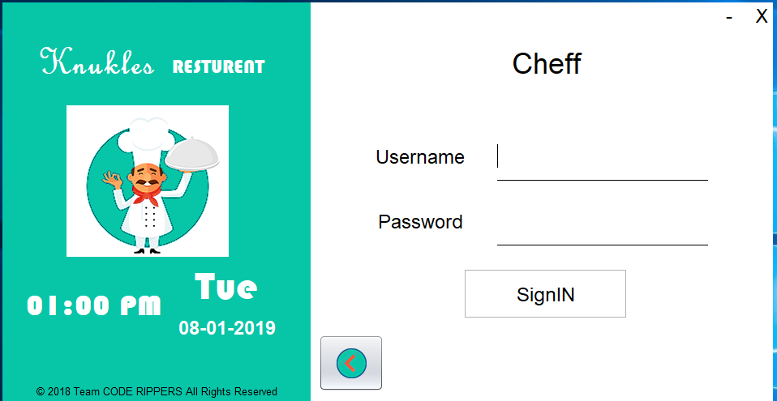
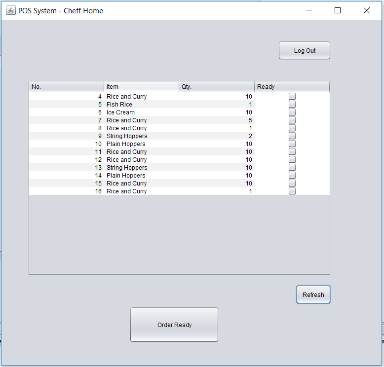
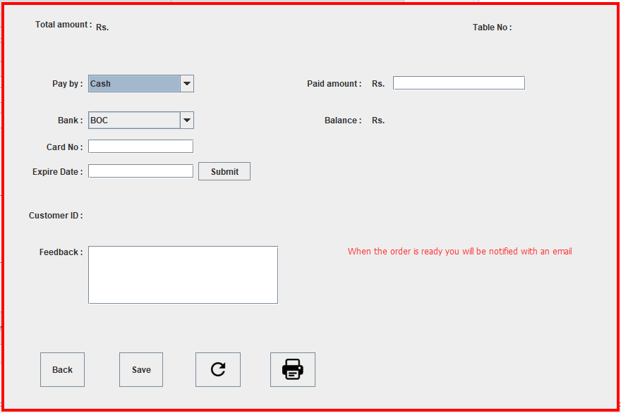
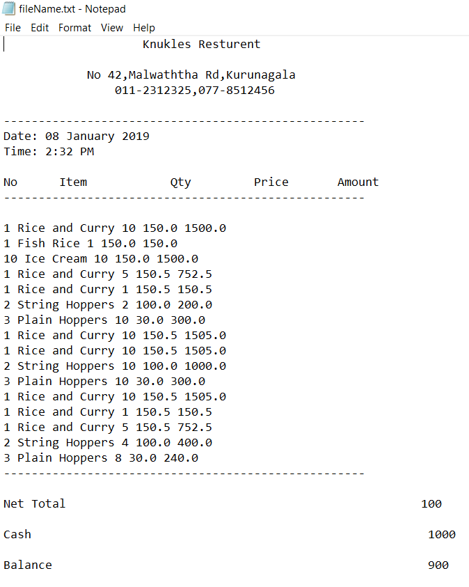

We expressed our gratitude to Mrs. Sulari Fernando, our humble lecturer and the module leader of Software Engineering for the internet using java, for the enormous help and guidance we received in completion of this project and the module

We would also like to extend our special thanks to all the lecturers and our dearest colleagues for their immense support and motivation thought our studies.

Finally, we would like to express our heartfelt affection to all those people who have been helpful and supportive thought the successful completion of the project
***
A stand-alone application that enables “Knuckles Restaurant” to provide an efficient self-service Point of Sales system (POS System). It is designed to be handled by the minimum number of employees. The interaction between the system and the customer has been maximized. Customer can reserve table and order food item using the automated menu. Once the user place an order kitchen gets the order details. When the order is ready the user will be notified with an email. 

The orders will be settled using First in First out(FIFO) basis.
***
## How our system addresses the drawbacks of a conventional system
Many of the current POS systems used in Sri Lanka today need operators. This requires lot of labour which is costly. In order to address this, we have created a POS system that enables self-service.

This system addresses many flows in the manually operating systems.

An automated POS system like what we have developed enables customers to quickly order and make payments without having to wait for a cashier to clear up.

In a conventional system if the cashier is crowded the customers have to wait in line to place the order or pay the bills. This is mainly because of having to pay for operators, restaurants usually employees only a couple of employees. In our system since there is no need for labour to operate the system, a restaurant can easily put multiple computers (with touch screen interfaces) so that even in busy hours’ customers won’t have to stay in a line.

Unlike in a conventional system where the customers have to wait till a waiter attends to them, which could take time if the restaurant is busy, in our system since everything (ordering and paying) is done by the customer himself, the above time delay is avoided.

The only possible delay that occurs is the waiting time till the kitchen fulfils the order. Because of the self-serviceability the restaurant gets the chance to prepare the meals real time and provide customers with fresh new foods.
***

***
## Screen shots

